# EBYS Belge Yönetim Sistemi


## Proje Özeti

**EBYS Belge Yönetim Sistemi**, kurum içi belge oluşturma, belge yönlendirme, imza/onay süreci, belge durum takibi ve PDF çıktısı alma işlemlerini dijital ortamda yönetmek amacıyla geliştirilmiş bir **ASP.NET Core MVC** uygulamasıdır.

Bu proje, klasik CRUD yapısının ötesine geçerek belge yaşam döngüsünü uçtan uca ele alır. Kullanıcılar belge oluşturabilir, taslak olarak kaydedebilir, ilgili imzacıya gönderebilir, gelen/giden evraklarını takip edebilir ve belge sonucuna göre e-posta bildirimi alabilir.

## Amaç

Projenin temel amacı, resmi yazışma ve belge yönetim süreçlerini daha düzenli, izlenebilir ve kullanıcı dostu bir web uygulaması üzerinden gerçekleştirmektir. Uygulama aynı zamanda MVC mimarisi, kimlik doğrulama, rol temelli kullanıcı yönetimi, veritabanı ilişkileri, servis katmanı ve üçüncü parti kütüphane entegrasyonları gibi yazılım geliştirme konularını bir arada uygulamaktadır.

## Temel Özellikler

- **Kullanıcı kimlik doğrulama:** ASP.NET Core Identity ile giriş, kayıt ve kullanıcı yönetimi.
- **Rol ve kullanıcı profili yapısı:** Farklı akademik/idari roller için kullanıcı profilleri.
- **Belge oluşturma:** Belge türü, konu, başlık, açıklama, gizlilik derecesi ve üst veri alanları.
- **Taslak yönetimi:** Tamamlanmamış belgeleri taslak olarak kaydetme ve sonradan düzenleme.
- **Gelen/Giden evrak takibi:** Kullanıcının kendisine gelen ve kendisinin gönderdiği belgeleri takip etmesi.
- **İmza ve onay süreci:** Belgelerin imzacıya gönderilmesi, onaylanması veya reddedilmesi.
- **Durum yönetimi:** Draft, Sent, Approved, Rejected ve Archived gibi belge durumları.
- **PDF çıktısı:** QuestPDF kullanılarak belge içeriğinin PDF formatında dışa aktarılması.
- **E-posta bildirimi:** Onay/red sonucunda belge sahibine otomatik bilgilendirme gönderilmesi.
- **Yapay zeka destekli yazım:** Resmi yazışma metni oluşturma veya mevcut metni geliştirme desteği.

## Kullanılan Teknolojiler

| Katman / Amaç | Teknoloji |
|---|---|
| Backend | ASP.NET Core MVC (.NET 8) |
| Programlama Dili | C# |
| Veritabanı Erişimi | Entity Framework Core |
| Kimlik Doğrulama | ASP.NET Core Identity |
| Veritabanı | SQL Server |
| Arayüz | Razor Views, HTML, CSS, JavaScript |
| PDF Oluşturma | QuestPDF |
| Bildirim | SMTP tabanlı e-posta servisi |
| Yardımcı Entegrasyon | Yapay zeka destekli belge yazımı |

## Mimari Yapı

Proje, MVC mimarisine uygun şekilde geliştirilmiştir. Veri modelleri, kullanıcı arayüzü ve iş akışı birbirinden ayrılmıştır.

```text
EBYS/
├── Controllers/
│   ├── DocumentController.cs
│   ├── DashboardController.cs
│   └── HomeController.cs
│
├── Models/
│   ├── Document.cs
│   ├── UserProfile.cs
│   ├── Department.cs
│   ├── DocumentAttachment.cs
│   └── DocumentAudit.cs
│
├── Views/
│   ├── Document/
│   ├── Dashboard/
│   ├── Home/
│   └── Shared/
│
├── Data/
│   ├── ApplicationDbContext.cs
│   ├── Migrations/
│   └── SeedData.cs
│
├── Services/
│   ├── EmailService.cs
│   └── EmailSender.cs
│
└── Areas/
    └── Identity/
```

## Belge İş Akışı

```text
Belge Oluşturma
      ↓
Taslak Kaydetme veya İmzaya Gönderme
      ↓
İmzacıya Gelen Evrak Olarak Düşme
      ↓
Onay / Red İşlemi
      ↓
Belge Sahibine E-posta Bildirimi
      ↓
Giden Evrak ve Durum Takibi
      ↓
PDF Çıktısı / Arşivleme
```

## Ekran Görüntüleri

Aşağıdaki ekran görüntüleri, uygulamanın temel modüllerini göstermektedir. Bu sayede projeyi inceleyen kişiler uygulamayı kendi bilgisayarına kurmadan sistemin genel akışını görebilir.

### Öne Çıkan Ekranlar

| Karşılama | Kontrol Paneli |
|---|---|
| 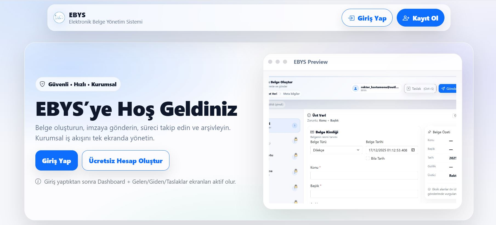 | 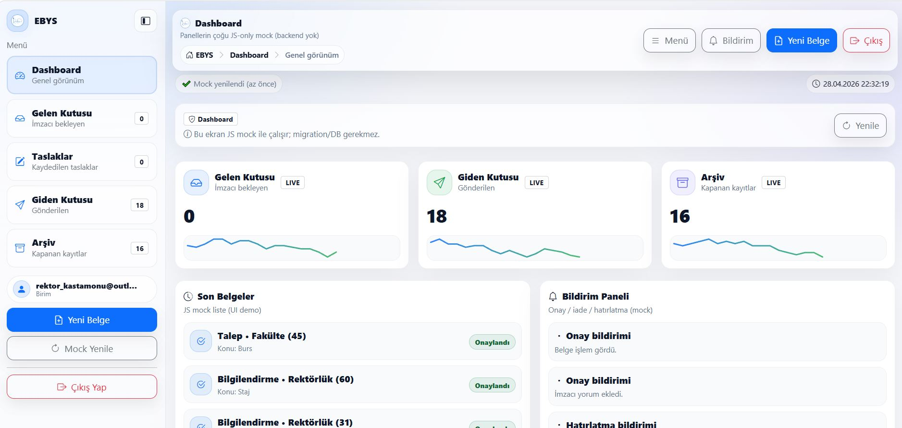 |

| Belge Oluşturma | İmzalama Süreci |
|---|---|
| 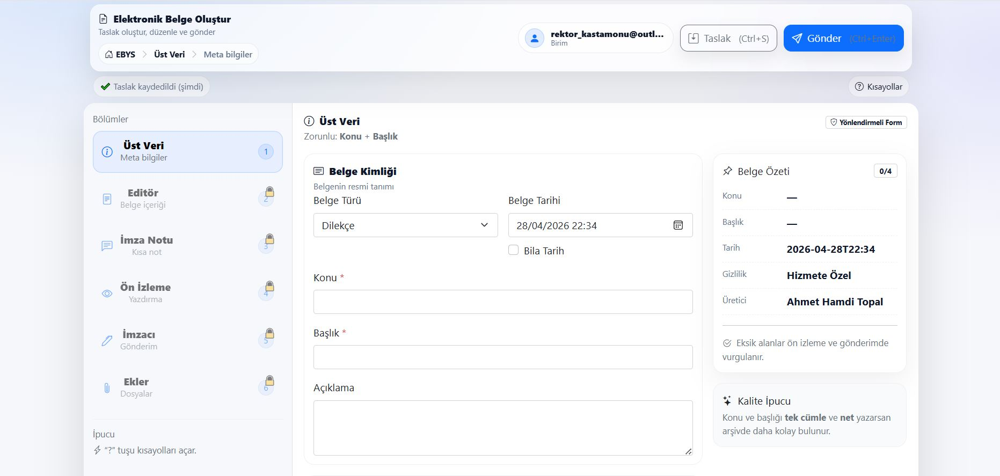 | 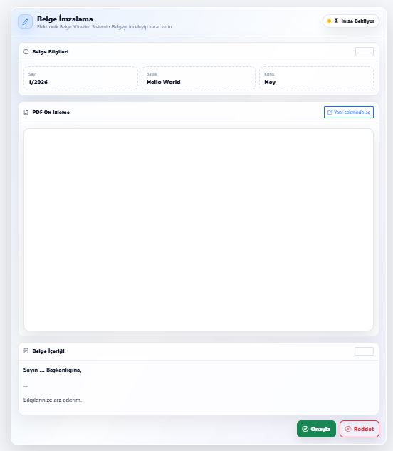 |


<summary><strong>Detaylı ekran görüntüleri ve açıklamaları</strong></summary>

### 1. Karşılama Ekranı


Sistemin ana karşılama sayfasıdır. Kullanıcıya EBYS’nin genel amacı tanıtılır ve giriş ya da belge oluşturma gibi temel işlemlere yönlendirme yapılır.

### 2. Proje Tanıtım Bölümü

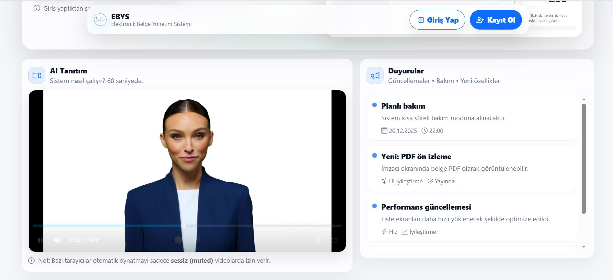

Uygulamanın sunduğu temel işlevleri ve kurumsal belge yönetimi yaklaşımını özetleyen tanıtım alanıdır. Bu bölüm, projeyi inceleyen kişilere sistemin kapsamını hızlı şekilde gösterir.

### 3. Özellikler ve Bilgilendirme Alanı

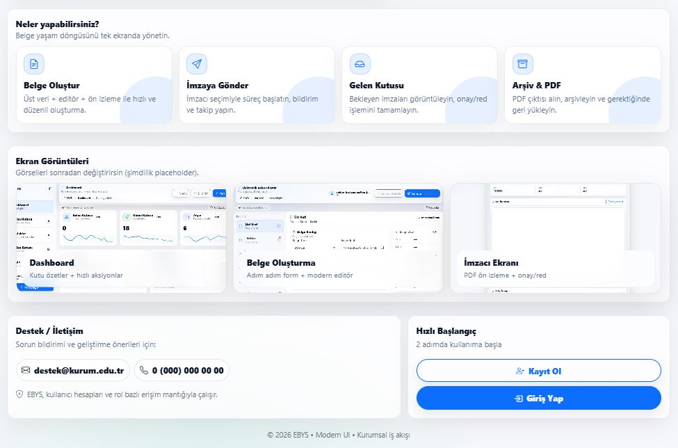

Belge oluşturma, imzaya gönderme, arşivleme ve PDF çıktısı alma gibi temel modülleri kart yapısı ile açıklayan bilgilendirme ekranıdır.

### 4. Giriş Ekranı

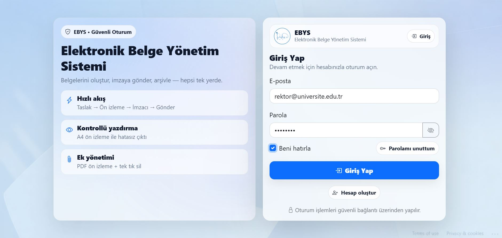

ASP.NET Core Identity altyapısı kullanılarak hazırlanan giriş ekranıdır. Kayıtlı kullanıcılar e-posta ve şifre bilgileriyle sisteme erişim sağlayabilir.

### 5. Kayıt Ekranı

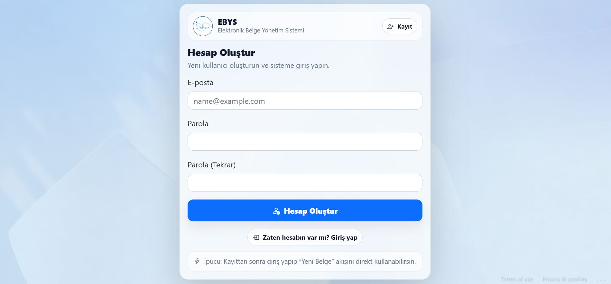

Yeni kullanıcıların sisteme kayıt olmasını sağlayan ekrandır. Kimlik doğrulama sürecinin bir parçası olarak kullanıcı bilgilerinin alınması hedeflenmiştir.

### 6. Kontrol Paneli


Kullanıcıya ait belge istatistiklerini, son işlemleri ve hızlı erişim alanlarını gösteren yönetim panelidir. Sistem içindeki belge akışının genel durumu bu ekrandan takip edilebilir.

### 7. Gelen Evrak Ekranı

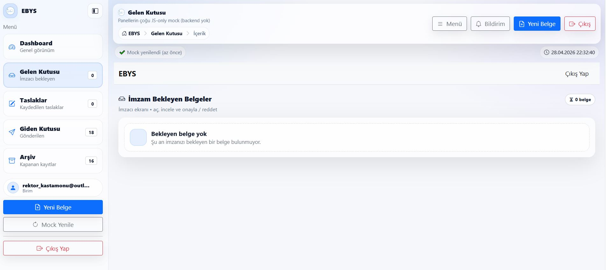

İmza veya işlem bekleyen belgelerin listelendiği ekrandır. Kullanıcı, kendisine yönlendirilen belgeleri bu bölümden görüntüleyebilir ve ilgili işlem ekranına geçebilir.

### 8. Taslak Belgeler Ekranı

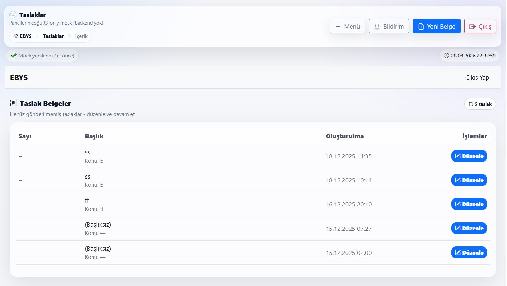

Henüz gönderilmemiş belgelerin saklandığı bölümdür. Kullanıcılar tamamlanmamış belgeleri daha sonra düzenlemek üzere taslak olarak kaydedebilir.

### 9. Giden Evrak Ekranı

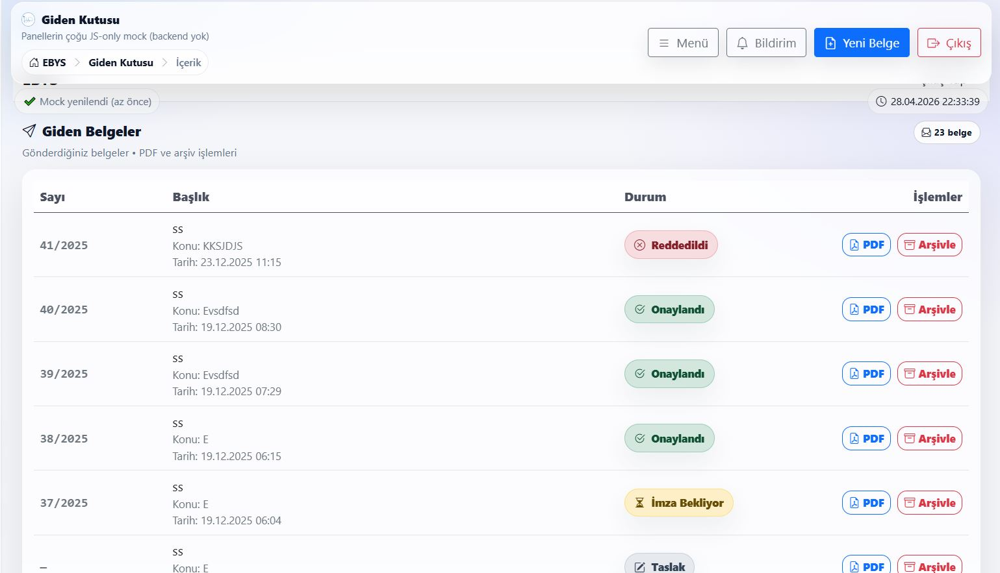

Kullanıcı tarafından oluşturulan ve gönderilen belgelerin durumlarını gösterir. Belgelerin beklemede, onaylandı, reddedildi veya taslak gibi durumları bu ekrandan takip edilebilir.

### 10. Belge Oluşturma Formu


Belgeye ait üst verilerin, belge türünün, konunun, başlığın, açıklamanın ve imzacı bilgilerinin girildiği ana oluşturma ekranıdır.

### 11. Doldurulmuş Belge Formu

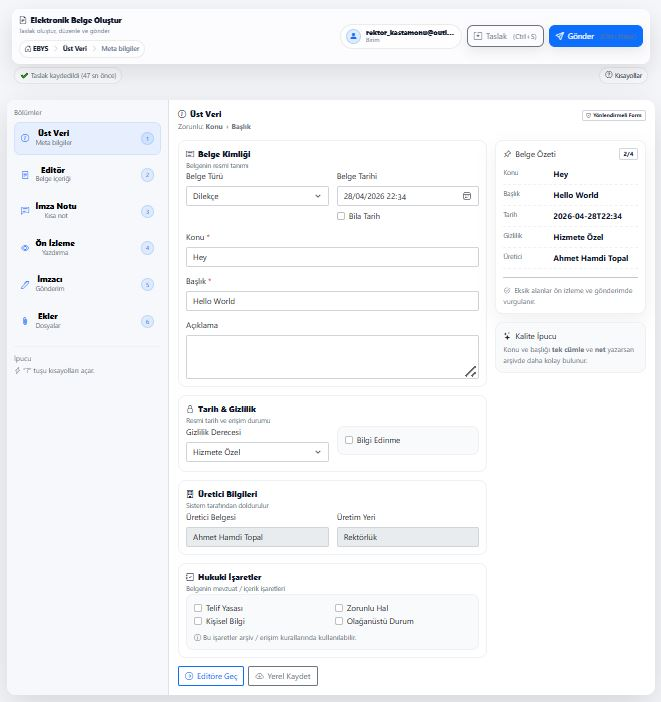

Belge oluşturma formunun örnek verilerle doldurulmuş halidir. Bu ekran, belge bilgilerinin sistematik şekilde kaydedildiğini gösterir.

### 12. Klavye Kısayolları

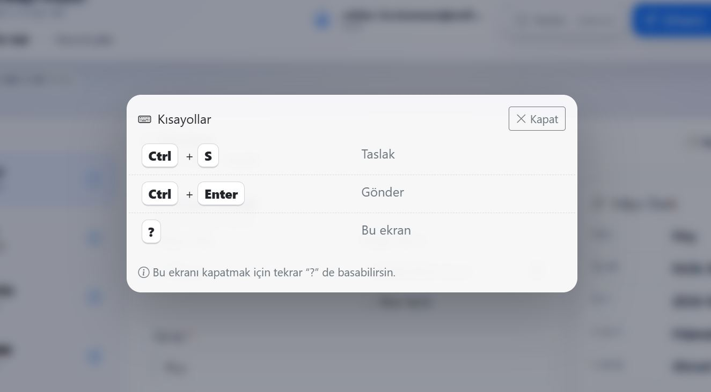

Belge yazım sürecini hızlandırmak için kullanılan kısa yol penceresidir. Taslak kaydetme, gönderme veya ekranı kapatma gibi işlemler klavye ile desteklenmiştir.

### 13. Belge Editörü

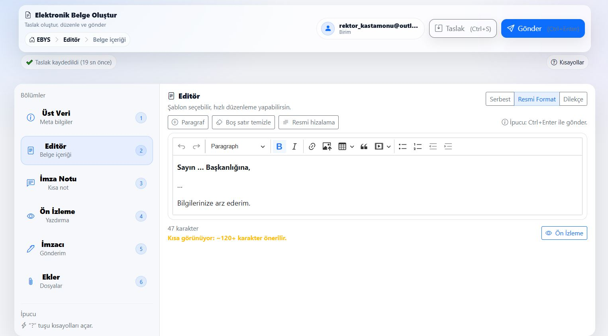

Kullanıcının resmi yazışma metnini düzenleyebildiği metin editörü alanıdır. Biçimlendirme araçları sayesinde belge içeriği düzenli ve okunabilir şekilde hazırlanabilir.

### 14. İmza Notu Alanı

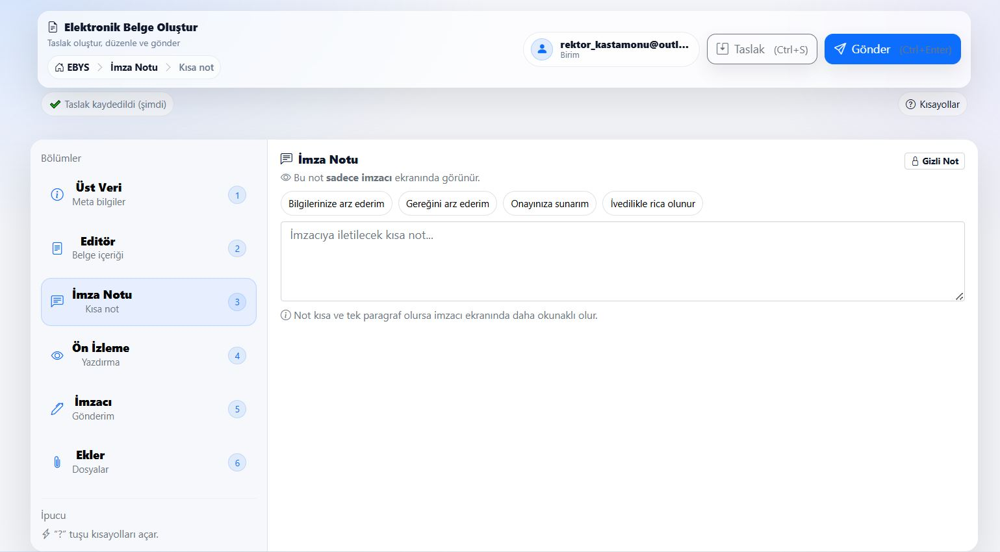

Belge imzaya gönderilmeden önce imzacıya iletilecek ek açıklama veya notların yazılabildiği bölümdür. Bu alan, belge değerlendirme sürecine bağlam ekler.

### 15. Belge Ön İzleme

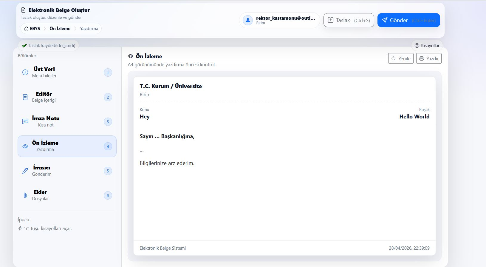

Oluşturulan belgenin gönderimden önce son halinin incelendiği ön izleme ekranıdır. Kullanıcı, belgeyi imzaya göndermeden önce içerik ve üst veri kontrolü yapabilir.

### 16. İmzacı Seçimi

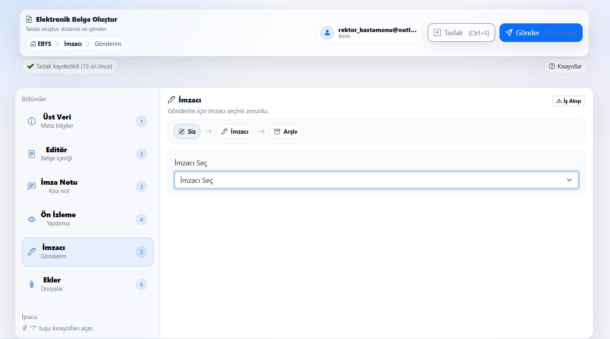

Belgenin hangi kullanıcı tarafından onaylanacağının seçildiği ekrandır. Bu yapı, belge akışının ilgili yetkiliye yönlendirilmesini sağlar.

### 17. Yapay Zeka Destekli Yazım Alanı

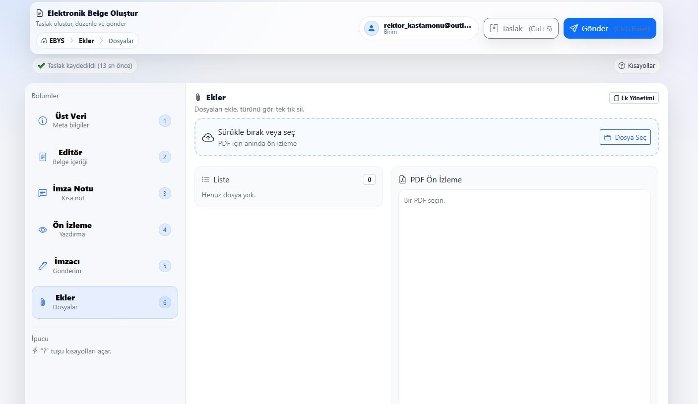

Belge içeriğinin hazırlanmasına yardımcı olan yapay zeka destekli yazım bölümüdür. Kullanıcı, resmi yazışma dilinde metin üretmek veya mevcut içeriği iyileştirmek için bu alanı kullanabilir.

### 18. Gönderim Sonrası Durum Takibi

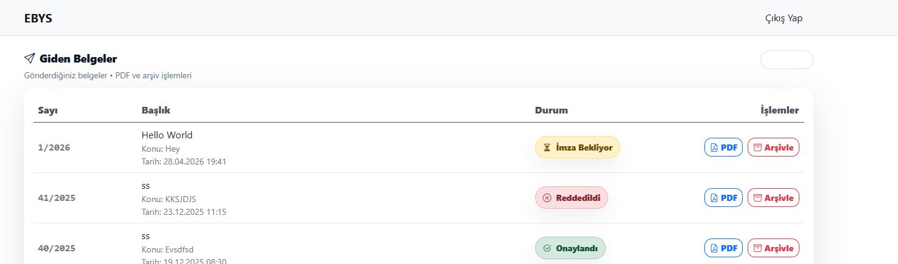

Belge gönderildikten sonra oluşan durum bilgisinin takip edildiği listedir. Kullanıcı, gönderdiği belgenin hangi aşamada olduğunu görebilir.

### 19. İmza Bekleyen Belgeler

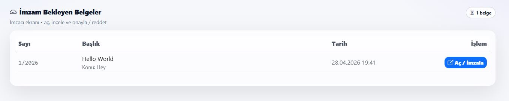

İmzacı rolündeki kullanıcı için bekleyen belgeleri gösterir. Onay sürecine dahil olan belgeler bu bölümden seçilip işleme alınabilir.

### 20. İmza Karar Ekranı

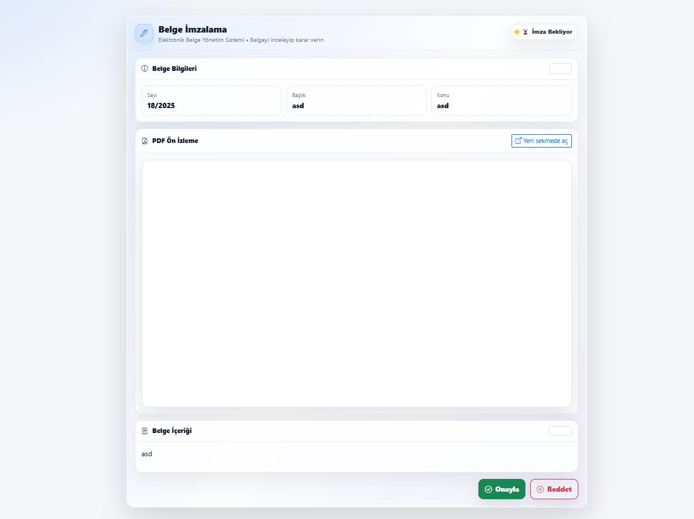

İmzacı tarafından belgenin incelendiği ve süreç sonucunun belirlendiği ekrandır. Kullanıcı belgenin içeriğini, notlarını ve işlem seçeneklerini bu bölümde görür.

### 21. E-posta Bildirimi

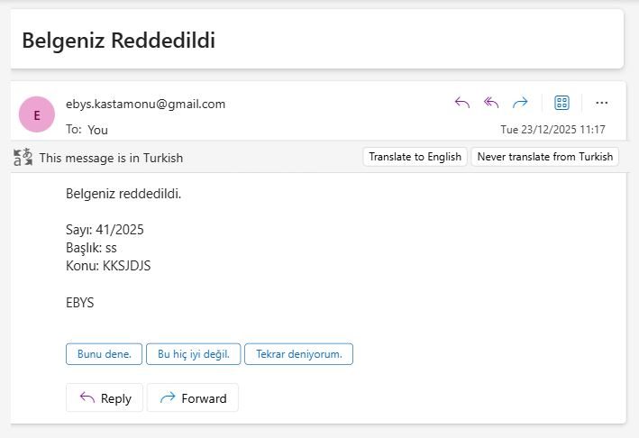

Belge onaylandığında veya reddedildiğinde belgeyi oluşturan kullanıcıya gönderilen bilgilendirme e-postasını gösterir. Bu özellik, belge sürecinin kullanıcıya dış bildirim olarak aktarılmasını sağlar.


## Kurulum

Projeyi yerel ortamda çalıştırmak için aşağıdaki adımlar izlenebilir.

### 1. Depoyu klonlayın

```bash
git clone https://github.com/RodinaAmrMukhtar/ebys-belge-yonetim-sistemi.git
cd ebys-belge-yonetim-sistemi
```

### 2. Bağımlılıkları yükleyin

```bash
dotnet restore
```

### 3. Veritabanı bağlantısını yapılandırın

`appsettings.json` veya kullanıcı gizleri üzerinden bağlantı bilgisini tanımlayın.

```json
{
  "ConnectionStrings": {
    "DefaultConnection": "Server=YOUR_SERVER;Database=EBYS;Trusted_Connection=True;TrustServerCertificate=True"
  }
}
```

### 4. Veritabanını oluşturun

```bash
dotnet ef database update
```

### 5. Uygulamayı çalıştırın

```bash
dotnet run
```

Uygulama çalıştıktan sonra tarayıcı üzerinden verilen localhost adresi açılabilir.

## Akademik Kazanımlar

Bu proje aşağıdaki yazılım geliştirme konularını uygulamalı şekilde göstermektedir:

- MVC mimarisi ile katmanlı web uygulaması geliştirme
- Entity Framework Core ile veritabanı modelleme ve migration yönetimi
- ASP.NET Core Identity ile kimlik doğrulama
- Kullanıcı bazlı belge akışı ve durum yönetimi
- PDF üretimi ve harici servis entegrasyonu
- E-posta bildirimi ile süreç takibi
- Kullanıcı dostu arayüz tasarımı
- Resmi belge süreçlerinin dijitalleştirilmesi

## Lisans

Bu proje akademik amaçlı olarak geliştirilmiştir. Kullanım ve geliştirme süreçlerinde kaynak gösterilmesi önerilir.
